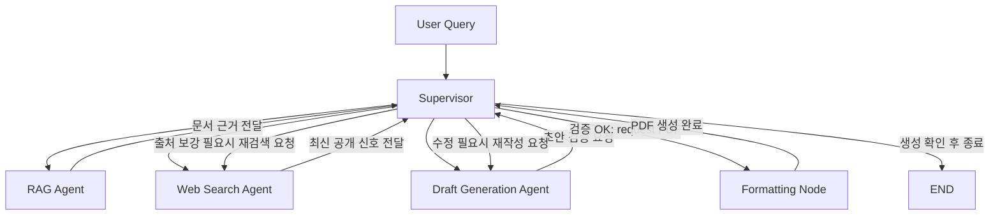

# Subject
SK hynix 관점에서 Samsung·Micron의 HBM, PIM, CXL 기술을 비교하고, 최신 공개 신호와 JEDEC 기반 RAG를 결합해 TRL 추정 보고서를 생성하는 Supervisor 중심 Multi-Agent 프로젝트입니다.



## Overview
- Objective : 최신 웹 공개 신호와 JEDEC/논문 기반 RAG를 결합해 반도체 경쟁사 기술 분석 보고서를 자동 생성한다.
- Method : Supervisor가 Web Search, RAG, Draft를 직접 호출하고 검증 후 재호출하는 중앙 통제형 워크플로우를 사용한다.
- Tools : LangGraph, OpenAI API, Tavily Search, FAISS/BM25 Ensemble

## Features
- PDF 자료 기반 정보 추출 : JEDEC 표준 문서, 논문, 기업 기술 PDF를 RAG 데이터 소스로 활용
- Supervisor 중심 품질 통제 : 하위 에이전트끼리 직접 연결하지 않고 Supervisor가 호출·검증·재호출 수행
- TRL 기반 분석 : 경쟁사 기술 성숙도와 위협 수준을 TRL 기준으로 비교하되, TRL 4~6은 추정 영역으로 명시
- 확증 편향 방지 전략 : 긍정/부정/객관 지표 기반 다중 쿼리와 재검색 루프 적용
- 상세 문서 : [agents/README.md](./agents/README.md), [tools/README.md](./tools/README.md), [core/README.md](./core/README.md), [data/README.md](./data/README.md), [output/README.md](./output/README.md)

## Tech Stack

| Category   | Details |
|------------|---------|
| Framework  | LangGraph, LangChain, Python |
| LLM        | GPT-4o via OpenAI API |
| Retrieval  | Hybrid Retrieval (BM25 + FAISS Ensemble), Hit Rate@5 = 100.0%, MRR@5 = 0.357 |
| Embedding  | BAAI/bge-m3 |

## Agents

- Supervisor: 전체 워크플로우를 통제하고 각 산출물을 검증한 뒤 다음 단계를 결정한다.
- Web Search Agent: 최신 공개 신호를 다중 쿼리 기반으로 수집해 확증편향을 줄인 웹 근거를 확보한다.
- RAG Agent: JEDEC 문서와 논문, 기술 자료에서 질의 관련 근거를 검색해 구조화된 컨텍스트를 제공한다.
- Draft Generation Agent: 수집된 근거를 바탕으로 TRL 기반 비교와 시사점을 포함한 보고서 초안을 작성한다.
- Formatting Node: 최종 승인된 Markdown 보고서를 PDF/문서 산출물로 변환한다.

## Architecture
상단 Mermaid 그래프와 [agents/README.md](./agents/README.md)에 전체 Supervisor 중심 아키텍처를 정리했습니다.

## Directory Structure
```text
miniproject/
├── data/                  # JEDEC, 논문, 기업 기술 PDF
├── agents/                # Supervisor / Web / RAG / Draft / Formatting
├── tools/                 # Search, Retriever 구현
├── core/                  # State 설계
├── output/                # 보고서 및 Retrieval 평가 결과
├── main.py                # 실행 스크립트
├── evaluate_rag.py        # Retrieval 평가
└── README.md
```

## Contributors
- 배수정 : Prompt Engineering, Agent 설계, 보고서 구조 설계, PDF/RAG 데이터 구성, Retrieval 실험, 평가 코드 정리
- 안가은 : Prompt Engineering, Agent 설계, 보고서 구조 설계, PDF/RAG 데이터 구성, Retrieval 실험, 평가 코드 정리
