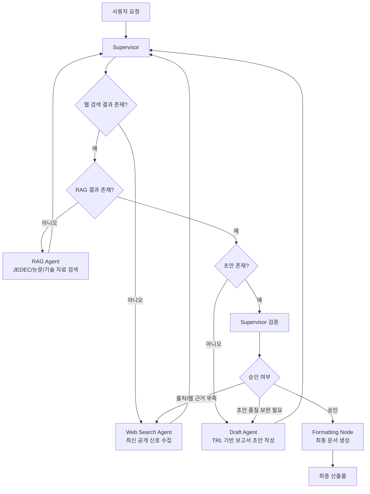

# SK hynix 경쟁사 기술 분석 Multi-Agent Pipeline



## 프로젝트 소개
이 프로젝트는 **Samsung / Micron / SK hynix**의 HBM, PIM, CXL 기술 동향을 비교하고, **TRL 기반 성숙도와 위협 수준을 추정하는 보고서 생성형 Multi-Agent 시스템**입니다.  
특히 **JEDEC 표준 문서 + 논문 + 기업 기술 자료 + 최신 웹 공개 신호**를 함께 사용해, 기술 전략 문서의 근거성과 최신성을 동시에 확보하는 데 초점을 맞췄습니다.

참고 산출물:
- [최종 보고서 예시](./output/ai-mini_output_3반_배수정+안가은.md)
- [Retrieval 평가 스크립트](./evaluate_rag.py)
- [Retrieval 평가 결과](./output/retrieval_metrics.json)

## 프로젝트 목표
- 반도체 경쟁사 기술 동향을 **최신 공개 신호와 내부 RAG 근거**를 결합해 분석한다.
- **TRL 기반 비교표**와 **SK hynix 중심 전략적 시사점**을 포함한 보고서를 자동 생성한다.
- 하위 에이전트가 독단적으로 끝내지 않고, **Supervisor가 호출-검증-재호출**을 반복하는 구조로 품질을 통제한다.

## 아키텍처 선택 이유 (Supervisor 선택 근거)
이 프로젝트는 Distributed 구조보다 **Supervisor 아키텍처**를 선택했습니다. 이유는 **검증-수정-보고서 생성 흐름을 중앙에서 통제하기 위해서**입니다.  
`Draft Agent`가 독단적으로 보고서를 확정하지 않고, 반드시 `Supervisor`가 결과를 받아 구조·출처·품질을 검토한 뒤 다음 노드를 결정합니다.  
또한 최종 변환 단계는 별도 에이전트가 아니라 **`Formatting Node`**로 두어, 승인된 초안만 산출물로 변환되도록 분리했습니다.

## 에이전트별 역할 요약
- `Supervisor`: 전체 워크플로우를 통제하고 각 하위 에이전트의 산출물을 검증한 뒤 다음 단계를 결정한다.
- `Web Search Agent`: 최신 공개 신호를 다중 쿼리 기반으로 수집해 편향을 줄인 웹 근거를 확보한다.
- `RAG Agent`: JEDEC 문서와 논문, 기술 자료에서 질의 관련 근거를 검색해 구조화된 컨텍스트를 제공한다.
- `Draft Agent`: 수집된 근거를 바탕으로 TRL 기반 비교와 시사점을 포함한 보고서 초안을 작성한다.
- `Formatting Node`: 최종 승인된 Markdown 보고서를 PDF/문서 산출물로 변환한다.

## Web Search 설계 및 확증편향 완화 전략
Web Search는 **최신 반도체 공개 신호 수집**을 위해 사용합니다.  
확증편향 완화를 위해 **긍정/부정/객관 지표 기반의 다중 쿼리 전략**을 적용했고, 기업 발표만 보지 않도록 제품 페이지, 언론 기사, 특허, 채용 공고, 학회/컨퍼런스 신호까지 함께 탐색합니다.

핵심 포인트:
- 공식 출처 우선: `news.samsung.com`, `semiconductor.samsung.com`, `micron.com`, `investors.micron.com`, `news.skhynix.com`
- 반대 근거 동시 검색: `yield`, `thermal`, `power`, `limitation`, `issue`, `drawback`, `benchmark`
- 객관 지표 보강: `patent`, `hiring`, `conference`, `news`
- 결과가 출처 면에서 약하거나 한쪽으로 치우치면, `Supervisor`가 **웹 재검색**을 지시한다.

## RAG / Retrieve 설계
RAG 데이터는 **JEDEC 표준 문서, 해외 논문, 기업 기술 자료 PDF**로 구성했습니다.  
특히 **JEDEC 표준 문서**를 넣은 이유는, 경쟁사 발표를 그대로 받아쓰지 않고 **기술 규격 문서 기반의 근거 확보**와 **표준 정합성 확인**을 하기 위해서입니다. 이 점이 본 프로젝트의 가장 큰 강점입니다.

구성 요약:
- 데이터 소스: `JEDEC`, 논문 PDF, 기업 기술 자료
- 검색 단위: PDF chunk 단위 검색 후 문서 수준으로 근거 활용
- 목적: 최신 웹 신호를 보완하는 **정적이고 신뢰도 높은 기술 근거층** 확보

## 오픈소스 임베딩 모델 선정

| 후보 모델 | 특징 | 판단 |
|---|---|---|
| `jhgan/ko-sroberta-multitask` | 한국어 문장 임베딩에 특화된 경량 모델 | 국문에는 강하지만 영문 기술 PDF와 교차언어 검색에는 한계가 있음 |
| `intfloat/multilingual-e5-large` | 다국어 지원이 뛰어난 고성능 임베딩 모델 | 성능은 우수하지만 긴 기술 문서 처리와 반도체 문맥 대응에서 추가 비교 필요 |
| `BAAI/bge-m3` | 다국어, 다중 입도, 다중 기능을 지원하는 최신 SOTA 모델 | **최종 선정** |

최종 선정 모델은 **`BAAI/bge-m3`** 입니다.  
선정 이유는 다음과 같습니다.
- 수집된 PDF 데이터(JEDEC 표준 규격서, 해외 논문 등)는 **영문 중심**, 사용자 질의와 기업 분석 맥락은 **국문 중심**이어서 **다국어/교차언어 검색**이 중요했습니다.
- `bge-m3`는 **교차 언어 검색 성능**이 우수해 채택했습니다.
- 반도체 논문은 긴 문맥 이해가 중요하므로 **최대 8192 토큰 입력 지원**과 **Dense 의미 벡터 성능**이 뛰어난 점을 근거로 삼았습니다.

## Retrieval 기법 선정

| 후보 기법 | 특징 | 판단 |
|---|---|---|
| Sparse Retrieval (`BM25`) | 단어 빈도 기반 검색으로 고유명사 매칭에 강하지만 문맥 이해에 약함 | 버전/제품명 탐지에 유리 |
| Dense Retrieval (`FAISS`) | 임베딩 벡터 기반 의미 검색으로 문맥 이해는 좋지만 숫자/버전 매칭이 약할 수 있음 | 의미 검색에 유리 |
| Hybrid Retrieval (`Ensemble`) | Sparse와 Dense의 장점을 결합 | **최종 선정** |

최종 선정 기법은 **`Hybrid Retrieval (BM25 + FAISS Ensemble)`** 입니다.  
반도체 도메인은 `HBM4`, `CXL 1.1`, `JEDEC`처럼 **고유 명사와 버전 정보**가 중요합니다. Dense 검색만으로는 숫자/버전이 미세하게 다른 문서를 놓칠 수 있어, **BM25와 FAISS(BGE-M3)를 4:6 가중치로 결합한 `EnsembleRetriever`**를 사용했습니다. 이 조합은 **의미적 유사성**과 **정확 키워드 매칭**을 동시에 확보합니다.

## TRL 기반 분석 및 한계
본 프로젝트는 경쟁사 기술 성숙도와 위협 수준을 **TRL 기반으로 추정**합니다.  
다만 **TRL 4~6 구간은 영업 비밀 특성상 공개 정보가 부족하므로 확정 판정이 아니라 ‘추정’ 영역**으로 취급합니다.

원칙:
- 특허, 학회 발표, 채용 공고, 제품 발표, 고객 검증 공개 등 **간접 지표**를 활용해 TRL 4~6을 추정
- 공개 정보가 부족하면 `정보 부족`, `판단 불가`, `추정 보류`로 명시
- 보고서에는 TRL 수치뿐 아니라 **판단 근거와 주요 출처**를 함께 표기

## State Key 설계 표

| 상태 그룹 | 주요 key | 설명 |
|---|---|---|
| `Global` | `messages`, `query`, `analysis_scope`, `final_report`, `workflow_status` | 사용자 요청, 전체 분석 범위, 최종 결과를 관리하는 전역 상태 |
| `Supervisor` | `next_agent`, `revision_count`, `missing_info_log` | 다음 호출 대상, 재시도 횟수, 반려 사유를 관리하는 제어 상태 |
| `Retrieval` | `web_raw_results`, `rag_raw_chunks` | 웹 검색 결과와 RAG 검색 결과를 분리 저장하는 검색 상태 |
| `Draft` | `current_draft`, `trl_justification` | 초안 본문과 초안 작성 관련 보조 정보를 담는 작성 상태 |

에이전트 간 데이터 오염을 막기 위해 상태를 분리 설계했습니다.  
또한 **Supervisor 제어 정보와 Retrieval 결과, Draft 결과를 분리하여 워크플로우의 안정성과 추적 가능성을 높였습니다.**

## 보고서 산출물 구조(보고서 목차)
- `SUMMARY`
- `분석 배경`
- `분석 대상 기술 현황`
- `경쟁사 동향 분석`
- `분석 한계`
- `전략적 시사점`
- `추가 조사 필요 영역`
- `REFERENCE`

## Retrieval 평가 결과 (Hit Rate@K, MRR)
현재 저장된 평가 결과는 [retrieval_metrics.json](./output/retrieval_metrics.json) 기준입니다.

| Metric | Value |
|---|---:|
| Hit Rate@1 | 20.0% |
| MRR@1 | 0.200 |
| Hit Rate@3 | 60.0% |
| MRR@3 | 0.333 |
| Hit Rate@5 | 80.0% |
| MRR@5 | 0.383 |

참고:
- 평가 스크립트: [evaluate_rag.py](./evaluate_rag.py)
- 실행 환경에 따라 `BAAI/bge-m3` 다운로드가 불가하면 폴백 임베딩이 사용될 수 있으므로, 제출 전 네트워크 환경에서 재측정할 수 있습니다.

## 실행 방법

```bash
cd miniproject

# 보고서 생성
python3 main.py

# Retrieval 평가
./.venv/bin/python evaluate_rag.py
```

필수 환경 변수:
- `OPENAI_API_KEY`
- `TAVILY_API_KEY`

## 폴더 구조

```text
miniproject/
├── agents/              # Supervisor / Web / RAG / Draft / Formatting
├── core/                # State 정의
├── data/                # JEDEC, 논문, 기술 자료 PDF
├── tools/               # Retriever, Search Engine
├── output/              # 생성 보고서 및 평가 결과
├── main.py              # 메인 워크플로우 실행
├── evaluate_rag.py      # Retrieval 성능 평가
└── README.md
```

## Contributors
- 배수정
- 안가은
